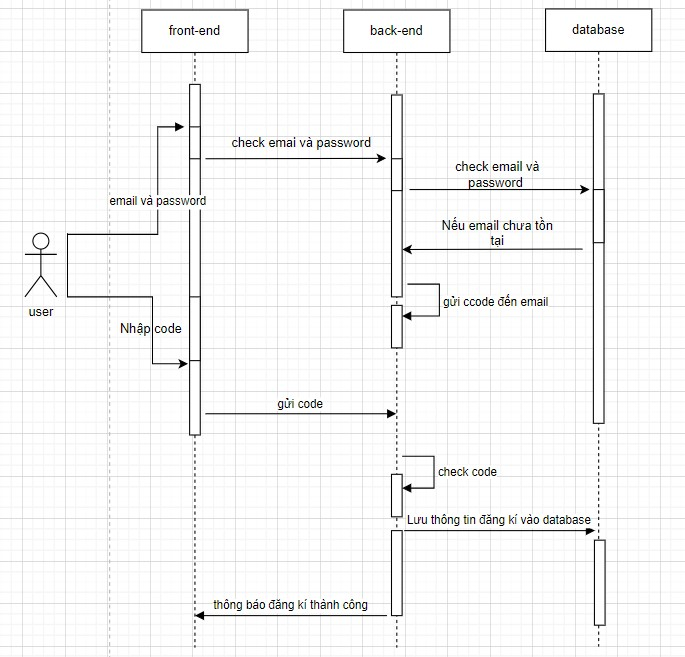

## hướng dẫn tải và chạy project công nghệ web backend fastapi

### b1: sử dụng git clone backend này về (di chuyển đến nơi muốn lưu dự án trong cmd gõ): git clone https://github.com/quyet12308/cn_web_backend_fastapi.git

### b2 : tài và cài đặt python (phải có pip)

### b3 : tải và cài đặt fastapi(sqlite là phần đi kèm gói python rồi không cần tải lại )(trong cmd gõ): pip install fastapi[all]

### b4 : mở dự án cong nghe web , mở terminal trong dự án gõ : python app1.py

### b5 : chạy dự án front end và trải nghiệm 

## Mô tả dự án dự án :

### Dự án backend công nghệ web fastapi sử dụng các công nghệ là : 

#### front-end: html ,css , js
#### back-end : fastapi , sqlite

### Các chức năng chính đã hoàn thiện :

#### Đăng ký: Người dùng có thể đăng ký tài khoản mới bằng cách cung cấp thông tin cá nhân như tên, email và mật khẩu. sử dụng API trong FastAPI để xử lý yêu cầu đăng ký này và lưu thông tin người dùng vào cơ sở dữ liệu SQLite. Có gửi email để xác thực người dùng sử dụng email đang ký.

#### Đăng nhập: Người dùng có thể đăng nhập vào hệ thống bằng tài khoản đã đăng ký. Sử dụng API để xác thực thông tin người dùng và tạo phiên làm việc (session) cho họ sau khi xác thực thành công.
	
#### Quên mật khẩu: Cung cấp chức năng khôi phục mật khẩu cho người dùng quên mật khẩu. Sử dụng email để gửi code xác thực cho người dùng thay đổi mật khẩu .

#### Xem thời tiết địa điểm du lịch: Kết nối với một dịch vụ thời tiết (như OpenWeatherMap) để lấy thông tin thời tiết cho các địa điểm du lịch. Sử dụng API của dịch vụ này để lấy thông tin thời tiết và hiển thị nó cho người dùng.

#### Edit user: Chỉnh sửa thông tin người dùng , nếu chỉnh sửa thông tin hợp lệ thì sửa thông tin vào database

### Cấu trúc dự án :

#### Trong folder database là các tệp database được sử dụng trong dự án ( do sqlite không có hệ quản trị database ) gồm các file .db như : database\booking_tour.db là file database chứa các thông tin về việc booking tour , database\catchat_code_for_send_email.db chứa các thông tin để cho quá trình xác thực code (trong 3 phút) hoạt động được , database\contact.db chứa các thông tin người dùng contact với website , database\login_register.db chứa các thông về việc đăng nhập đang ký và quên mật khẩu của người dùng , database\tourist_destination_information.db chứa các thông tin về các tour du lịch của web để front-end lấy và hiển thị , database\user_infor.db chứa các thông tin nâng cao hơn về user (như : ảnh đại diện và ngày sinh)

#### Trong folder base_code là các tệp base chứa các hàm thường sử dụng trong dự án (có 2 file là base_code\security_info.py,base_code\string_python_en.py là các tệp nội bộ chứa các thông tin cần thiết , key để sử dụng các chức năng có bảo mật ) , base_code\cover_base_64_img.py là file cover dạng ảnh byte thành dạng base64 để tiện lưu và truyền tải 

#### Trong folder email_with_python chứa các tệp để xây dựng và sử dụng email trong dự án cụ thể là tệp email_with_python\send_emails.py chứa các hàm mà khi gọi thì nó sẽ thực hiện công việc gửi các loại email cho người dùng như đăng ký , quên mật khẩu và contact.

#### Trong folder test_python_code là folder chứa các tệp test để thử nghiệm trước khi mang vào dự án chính

#### File app1.py là file chính trong dự án ( file chạy Fastapi) chứa các api để thao tác các chức năng với front-end và api khác để lấy dữ liệu 

#### File connect_open_weather_api.py chứa các hàm thao tác , lấy và lọc data để gửi cho front-end hiển thị 

#### File contact_database.py chưa các hàm thao tác với cơ sở dữ liệu phần contact 

#### File catcha_code_for_send_email.py chứa các hàm thao tác với catcha code để tiến hành gửi email xác thực

#### File home_screen_database.py chứa các hàm thao tác với database\tourist_destination_information.db để cho front-end lấy và sử lý dữ liệu cũng như hiển thị giao diện 

#### File login_register_database.py chứa các hàm thao tác với database\login_register.db để sử lý các chức năng đăng ký , đăng nhập và quên mật khẩu .

### Mô tả chi tiết bằng biểu đồ
